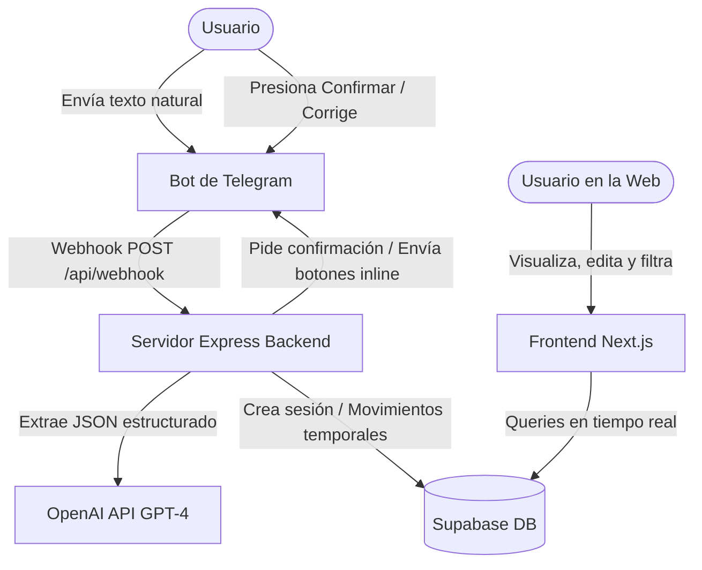

# 📊 AppCuentas — Gestor de Finanzas Inteligente con IA y Telegram

**AppCuentas** es una plataforma moderna para el control de gastos e ingresos personales. Combina la comodidad de registrar transacciones mediante **mensajes de voz o texto en lenguaje natural** usando un **Bot de Telegram potenciado por OpenAI**, con la potencia de un **Dashboard web interactivo en Next.js** para visualizar, filtrar y editar tus movimientos en tiempo real. Todo respaldado por una base de datos segura y en tiempo real con **Supabase**.

---

## 🏗️ Arquitectura del Sistema

El proyecto está estructurado en tres componentes principales:



*   **`database/`**: Contiene el esquema de base de datos relacional para Supabase, configurado con enums, tablas de movimientos, sesiones del bot de Telegram e índices optimizados.
*   **`backend/`**: API en Express escrita en TypeScript. Procesa los webhooks de Telegram, interactúa con la API de OpenAI para estructurar los datos e implementa una máquina de estados para flujos de conversación interactivos (campos faltantes o correcciones).
*   **`frontend/`**: Aplicación web desarrollada en Next.js con Tailwind CSS y Lucide Icons, que permite la administración completa de los registros confirmados de forma rápida y responsiva.

---

## ⚡ Características Principales

*   🤖 **Procesamiento de Lenguaje Natural**: Registra transacciones con oraciones como *"recibí 15000 de nómina por transferencia"* o listas complejas como *"200 super y 600 crossfit con tarjeta"*.
*   💬 **Máquina de Estados Conversacional**: Si el bot detecta que falta información obligatoria (por ejemplo, el monto o si es gasto/ingreso), te preguntará interactivamente antes de registrar.
*   ✍️ **Corrección por Mensaje**: ¿Cometiste un error? Responde al bot con *"el del super fue 250"* o *"el crossfit fue en efectivo"* y el bot corregirá la transacción automáticamente usando IA.
*   🔒 **Confirmación antes de Guardar**: Tus datos solo se reflejarán en la base de datos confirmada tras presionar el botón inline **Confirmar Todo ✅** desde Telegram.
*   📊 **Dashboard de Control**:
    *   Indicadores clave de rendimiento (Ingresos totales, Gastos totales y Balance neto).
    *   Filtros dinámicos por mes y por categoría de gasto/ingreso.
    *   Modificación directa (Edición y Eliminación) de cualquier movimiento desde la tabla interactiva.
    *   Sincronización manual instantánea con la base de datos.

---

## 🚀 Requisitos Previos

Asegúrate de contar con:
*   [Node.js](https://nodejs.org/) v18 o superior.
*   Una cuenta de [Supabase](https://supabase.com/).
*   Un Bot de Telegram (puedes crearlo conversando con [@BotFather](https://t.me/BotFather)).
*   Una API Key de [OpenAI](https://platform.openai.com/).
*   Una herramienta de túnel local como [localtunnel](https://github.com/localtunnel/localtunnel) o [ngrok](https://ngrok.com/) para exponer el puerto del backend a Telegram (en desarrollo).

---

## 🛠️ Configuración e Instalación

### 1. Base de Datos (Supabase)
1. Crea un nuevo proyecto en Supabase.
2. Ve al editor SQL del panel de Supabase y ejecuta el contenido del archivo [`database/schema.sql`](file:///d:/Development/appCuentas/database/schema.sql) para crear las tablas, tipos e índices necesarios.

### 2. Configuración del Backend
1. Dirígete a la carpeta `/backend`.
2. Crea tu archivo de variables de entorno `.env` (puedes basarte en el de desarrollo) con las siguientes variables:
   ```env
   PORT=3001
   TELEGRAM_BOT_TOKEN=tu_token_de_telegram_bot
   OPENAI_API_KEY=tu_api_key_de_openai
   SUPABASE_URL=tu_url_de_supabase
   SUPABASE_SERVICE_ROLE_KEY=tu_clave_service_role_de_supabase
   WEBHOOK_URL=tu_url_publica_de_localtunnel_o_ngrok
   ```
3. Instala las dependencias y arranca el servidor:
   ```bash
   npm install
   npm run dev
   ```

### 3. Configuración del Frontend
1. Dirígete a la carpeta `/frontend`.
2. Crea tu archivo `.env.local` con las variables de conexión públicas de Supabase:
   ```env
   NEXT_PUBLIC_SUPABASE_URL=tu_url_de_supabase
   NEXT_PUBLIC_SUPABASE_ANON_KEY=tu_clave_anon_de_supabase
   ```
3. Instala las dependencias y arranca el servidor Next.js:
   ```bash
   npm install
   npm run dev
   ```
4. Abre [http://localhost:3001](http://localhost:3001) en tu navegador para ver la interfaz.

---

## 🤖 Uso del Bot de Telegram

1. Busca tu bot en Telegram e inicia la conversación con `/start`.
2. Envía un mensaje reportando tus movimientos:
   *   *«150 pesos en tacos con amigos»* (Registra un gasto).
   *   *«Deposité 4500 de rendimiento de cetes»* (Registra un ingreso).
   *   *«Compré despensa 850 en walmart con tarjeta y pagué 250 de gasolina»* (Registra múltiples movimientos a la vez).
3. Revisa la pre-confirmación consolidada que te enviará el bot.
4. Si todo es correcto, haz clic en **Confirmar Todo ✅**. ¡Y listo! Aparecerá instantáneamente en el Dashboard Web.

---

## 💻 Desarrollo

Para ejecutar ambos entornos de forma local, abre dos pestañas en tu terminal y ejecuta:

**Pestaña 1 (Backend):**
```bash
cd backend
npm run dev
```

**Pestaña 2 (Frontend):**
```bash
cd frontend
npm run dev
```
